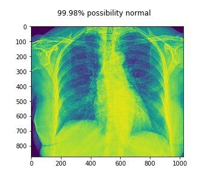
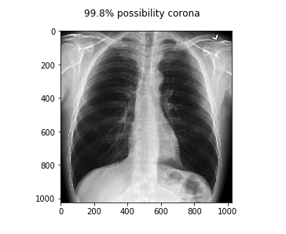

# COVID-19-DETECT
Detect Covid-19 with Chest X-Ray Data.

## INSTALLATION

```

pip install -r requirements.txt

```



## USAGE

```

python3 covid.py -d dataset

```




## DATASET

**https://github.com/ieee8023/covid-chestxray-dataset**


